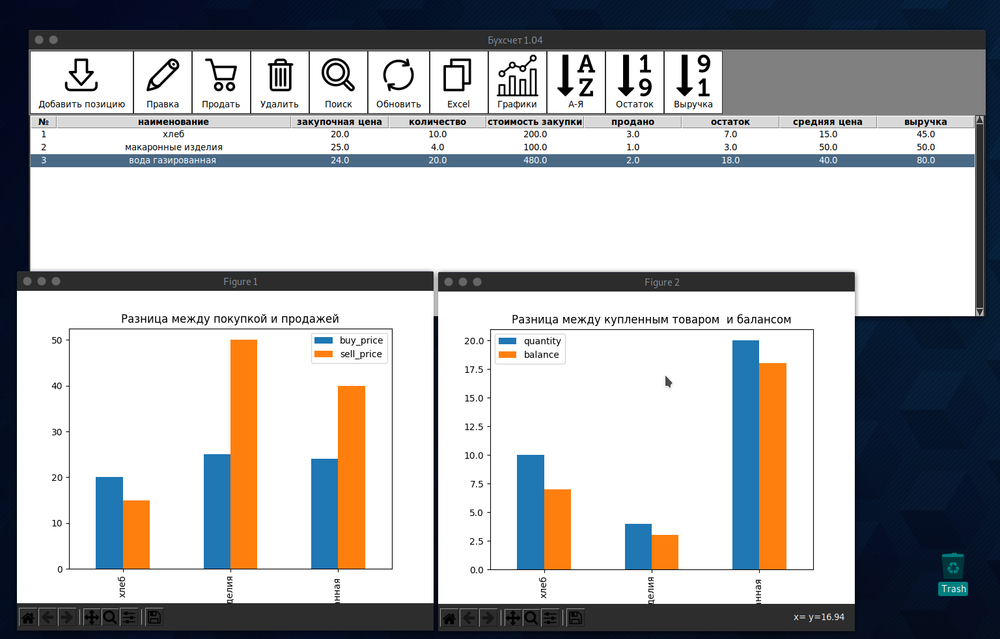

# counter app 



### Выполнить последовательно команды в терминале 

1. Клонирование репозитория 
```
git clone https://github.com/Timenem/counter.git
```

2. Создание вирутального окружения 
```
virtualenv env 
```
3. Активировать виртуальное окружение 
```
source env/bin/activate
```
4. Установка зависимостей 

> :warning: **Приложение не будет работать без установленных модулей pandas , matplotlib.**
```
pip install -r requirements.txt
```
5. Запуск приложения 
```
python main.py
```

